# DevOps Guide

This mind map shows the key topics that a person interested in learning DevOps should focus on. The mind map is divided into several main areas, each with its own subtopics.

## Mind Map

```mermaid
graph TD

A[DevOps]

A --> H[Culture]

H --> HL[3 Ways]
H --> HM[CALMS]
H --> HL[Team Topologies]
H --> HN[SRE]

H --> HM[Agile]


HM --> HO[LEAN]
HM --> HP[Scrum]


A--> N[Software Engineering]

N --> NA[APIs]
N --> NB[Programming]
N --> NC[Scripting]
N --> ND[Databases]
N --> NE[Solutions Design]
N --> NF[UML]


A --> B[Linux]


B --> D[Networking]

D --> O[IP Addressing]
D --> T[DNS]
D --> Q[Load Balancing]
D --> R[Network Security]
D --> S[Network Protocols]

B --> F[Filesystems]

F --> W[File System Types]
F --> X[File Permissions]
F --> Y[Filesystem Security]

C --> CA[Containers]

CA --> J[Containerization]

J --> JA[Docker]
J --> JB[Podman]


CA --> K[Container Orchestration]

K --> KA[Kubernetes]

KA --> S[K8s Architecture]
KA --> T[K8s Deployment]
KA --> U[K8s Resources]
KA --> V[K8s Operators]

K --> KB[Docker Swarm]

A --> C[Tooling]

C --> G[Source Control]

G --> GA[Git]
G --> GB[SVN]

C --> L[Configuration Mgmt]

L --> LA[Ansible]
L --> LB[Chef]
L --> LC[Puppet]

C --> M[Infrastructure as Code]

M --> MA[Terraform]
M --> MB[CloudFormation]

C --> I[Testing Tools]

A --> O[Observability]

O --> OA[Monitoring]
O --> OB[Logs]
O --> OC[Metrics]
O --> OD[Tracing]

A --> P[Cloud]

P --> PA[Cloud Native]
PA --> PAA[CNCF]
PA --> PAB[12 Factors Apps]
PA --> PAC[Cloud Native Applications]

P --> PB[AWS]

PB --> PBA[IAM]
PB --> PBC[Networking]
PB --> PBD[Lambdas]
PB --> PBE[EC2]
PB --> PBF[S3]
PB --> PBG[EKS]

P --> PC[GCP]

PC --> PCA[IAM]
PC --> PCB[VPC]
PC --> PCC[GKE S2]
PC --> PCD[Cloud Storage]
PC --> PCE[Cloud Run/ App Engine]
PC --> PCF[Cloud Spanner]
PC --> PCG[Cloud SQL]
PC --> PCH[Pub/Sub S2]

P --> PD[Azure]

PD --> PDA[VNETs]
PD --> PDB[Blobs storage]
PD --> PDC[Azure DevOps]

P --> PF[Openstack]

PF --> PFA[Networks]
PF --> PFB[KVM]
PF --> PFC[Bridges]
PF --> PFD[Virtual interfaces] 

```

## Topics

### Linux

- [Linux Operating System](https://github.com/lmtrarbach/devops-guide/wiki/Introduction-to-the-Linux-Operating-System)
- [Basic Linux Commands](https://github.com/lmtrarbach/devops-guide/wiki/Basic-Linux-Commands)
- [Advanced Linux Commands](https://github.com/lmtrarbach/devops-guide/wiki/Advanced-Linux-Commands)
- [Linux Networking Configuration](https://github.com/lmtrarbach/devops-guide/wiki/Basic-Network-Configuration)
- [Linux Networking Commands](https://github.com/lmtrarbach/devops-guide/wiki/Linux-Networking-Commands)
- [Linux Filesystem](https://github.com/lmtrarbach/devops-guide/wiki/Filesystem-Hierarchy-Standard)
- [Linux Services and Kernel](https://github.com/lmtrarbach/devops-guide/wiki/Linux-Services)
- [Linux bridges and interfaces](https://github.com/lmtrarbach/devops-guide/wiki/Linux-Bridges-and-Interfaces)
- [The-Linux-Programming-Interface](https://github.com/lmtrarbach/devops-guide/wiki/The-Linux-Programming-Interface)

### Culture
- [The DevOps Culture](https://github.com/lmtrarbach/devops-guide/wiki/Culture)
- [CALMS](https://github.com/lmtrarbach/devops-guide/wiki/CALMS)
- [LEAN - Basics](https://github.com/lmtrarbach/devops-guide/wiki/LEAN)

### Tooling

- Source control management (e.g., Git, SVN)

- Containerization tools (e.g., Docker, Podman)

- Container orchestration tools (e.g., Kubernetes, Docker Swarm)

- Configuration management tools (e.g., Ansible, Chef, Puppet)

- Infrastructure as Code tools (e.g., Terraform, CloudFormation)

### Networking

- Network protocols (e.g., TCP/IP, HTTP, HTTPS)

- IP addressing and subnetting

- DNS (Domain Name System)

- Load balancing

- Network security (e.g., firewalls, VPNs)

### Kubernetes

- Kubernetes architecture and components

- Deploying and managing applications on Kubernetes

- Kubernetes resources (e.g., pods, services, deployments)

- Kubernetes operators and controllers

### Filesystems

- Different types of file systems (e.g., ext4, XFS, NTFS)

- File permissions and ownership

- Filesystem security

## Getting Started

To get started with DevOps, you should focus on learning the basics of Linux and Lean culture, as well as mastering the key tools and technologies used in the field. The mind map above provides a useful overview of the different areas to focus on, and the subtopics that fall under each area.

Once you've mastered the basics, you can start exploring more advanced topics like cloud native development, advanced Kubernetes features, and more. Good luck on your DevOps journey!
